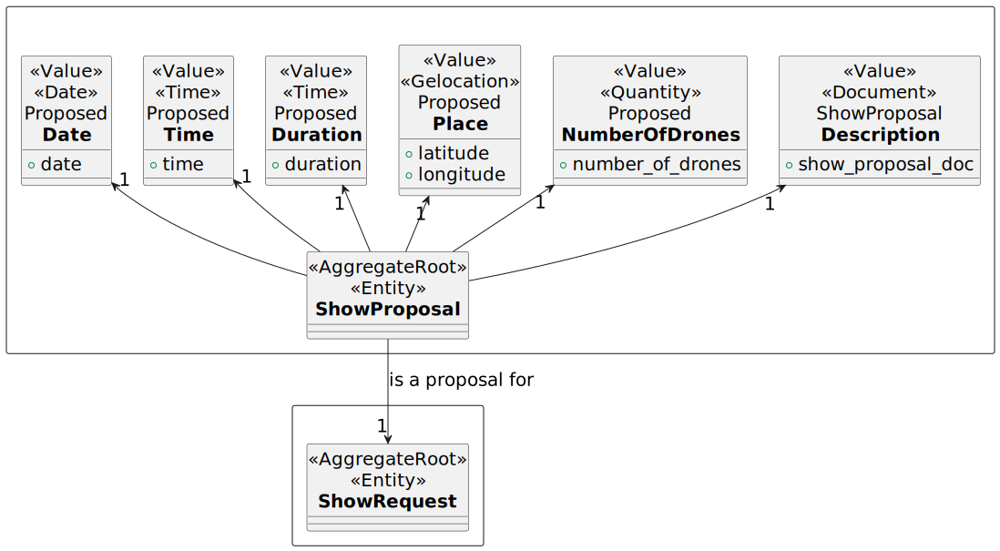
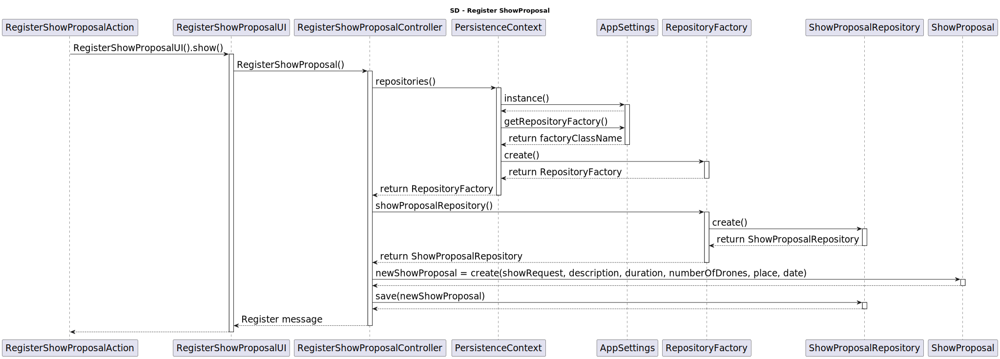

# US310 Create Show Proposal

As CRM Collaborator I want to start the process for creating a show proposal so that we can reply to the customer.

# Customer Specifications
The show proposal includes the total number of drones to be used in the show. 
Currently, all figures in a show must use all drones. The show proposal must follow a predefined template.

## Acceptance Criteria
- All inputs are required
- The show proposal must include:
  - Show Request
  - Description of the show
  - Duration
  - Number of drones
  - Place
  - Date
- The show proposal must be saved in the system

## Dependencies
none

## Input and Output Data
*Input:*
- Show Request
- Description of the show
- Duration
- Number of drones
- Place
- Date

*Output:*
- A message saying the proposal was created successfuly

## Definition of done
- Add Show Proposal to the system
- An interface for the user exists
- There's tests implemented

# Analysis

## Domain

# Design

 