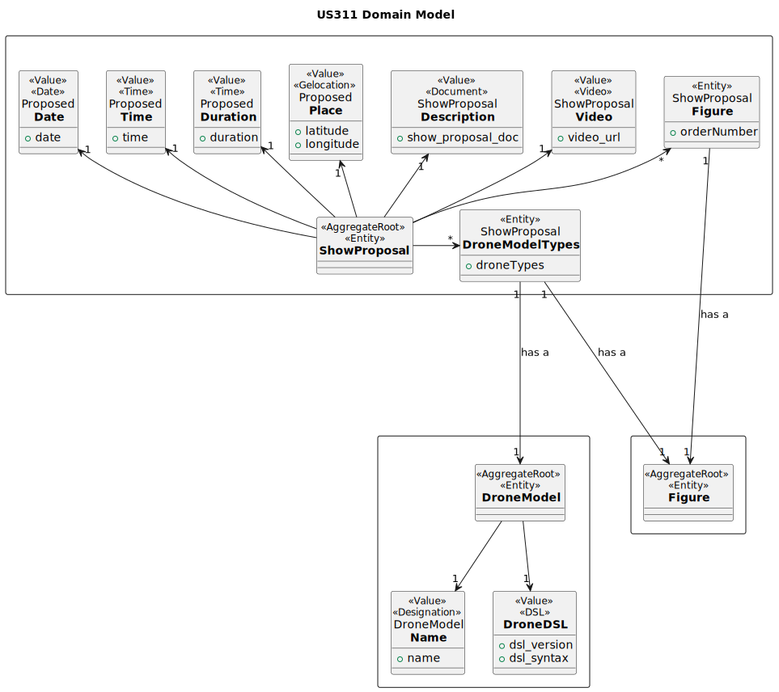
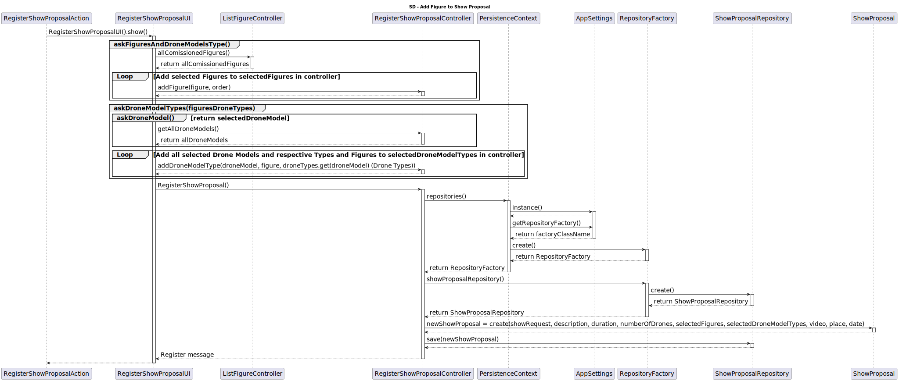

# US312 Add drones to a proposal

As a CRM Collaborator, I want to configure the list of drone models (number of drones and model) of a show proposal.

# Customer Specifications 
The drones in the proposal must be compatible with the drones in Shodrone’s inventory. There is no need to verify if these drones are used in another show on the same date.

## Acceptance Criteria
- The drones in the proposal must be compatible with the drones in Shodrone’s inventory.

## Dependencies
- US310 Create Show Proposal

## Input and Output Data
*Input:*
- Drone Models

*Output:*
- A message saying the models were mapped to drone types

## Definition of done
- Code is written and reviewed
- Tests are written and passed
- Documentation updated

# Analysis

## Domain

# Design

## System Sequence Diagram

