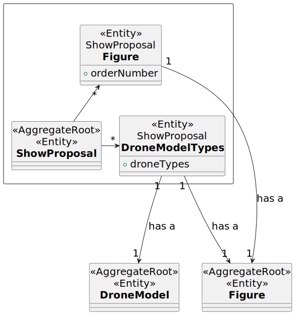
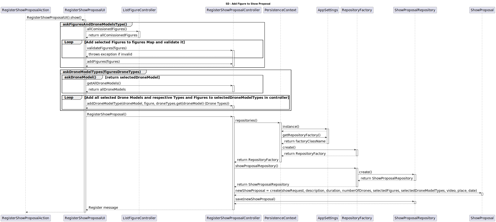

# US312 Add figures to a proposal

As a CRM Collaborator, I want to add one of the available figures to a show proposal.

# Customer Specifications 
Any active figure can be added to the show proposal.
A figure may have more than one occurrence in a show, but never in two consecutive positions.
For each figure, it must be established the relation between each drone type in the figure and the drone models in the show.

## Acceptance Criteria
- Any active figure can be added to the show proposal.
- A figure may have more than one occurrence in a show, but never in two consecutive positions.
- For each figure, it must be established the relation between each drone type in the figure and the drone models in the show.

## Dependencies
- US310 Create Show Proposal
- US311 Add drones to a proposal

## Input and Output Data
*Input:*
- Figures of a show
- Relation between the drone models in the show and the figures drone types

*Output:*
- A message saying the figures was added successfuly
- A message saying the relation Drone Model - Drone Type was added successfuly

## Definition of done
- Add Show Proposal with the figures and the respective relations between drone models to the system
- An interface for the user exists
- There's tests implemented

# Analysis

## Domain

# Design

