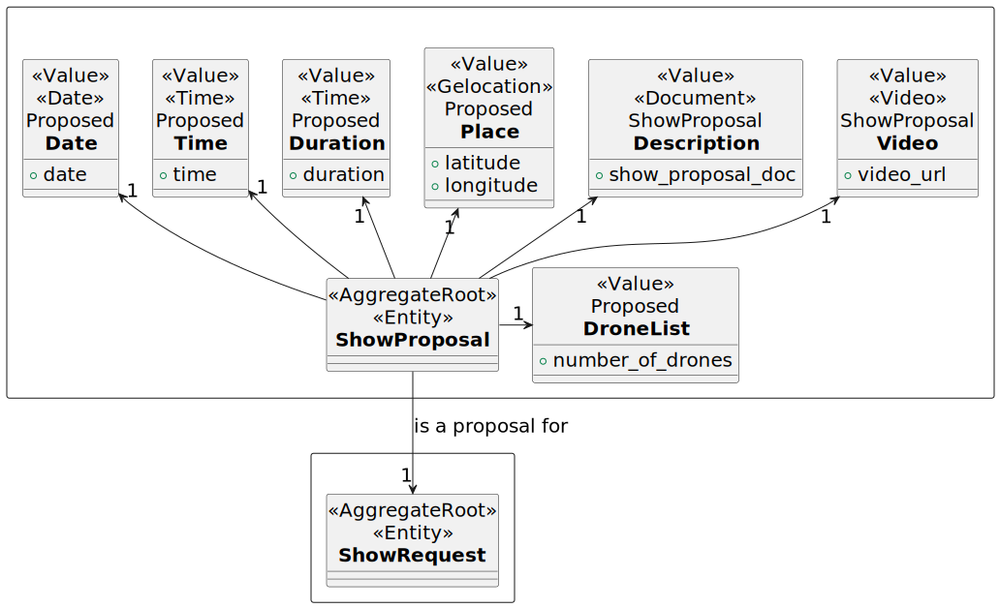
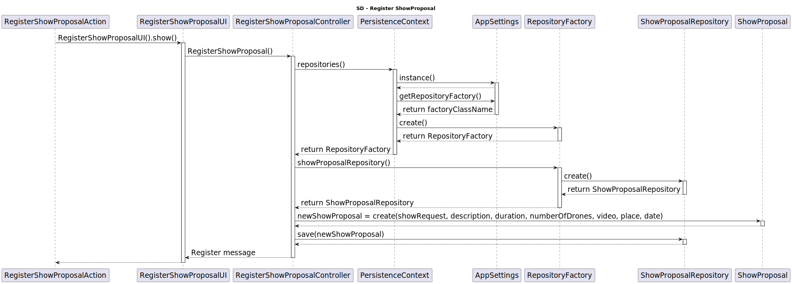

# US315 Add video of simulation to the proposal

As CRM Collaborator, I want to add a video of the simulated show so the customer can have a preview of the show.

# Customer Specifications
none

## Acceptance Criteria
- The video must be a URL.
  - The URL must be valid.

## Dependencies
- US310 Create Show Proposal

## Input and Output Data
*Input:*
- Video URL

*Output:*
- A message saying the video was added successfully.

## Definition of done
- Add video URL to the proposal
- An interface for the user exists
- There's tests implemented

# Analysis

## Domain

# Design

