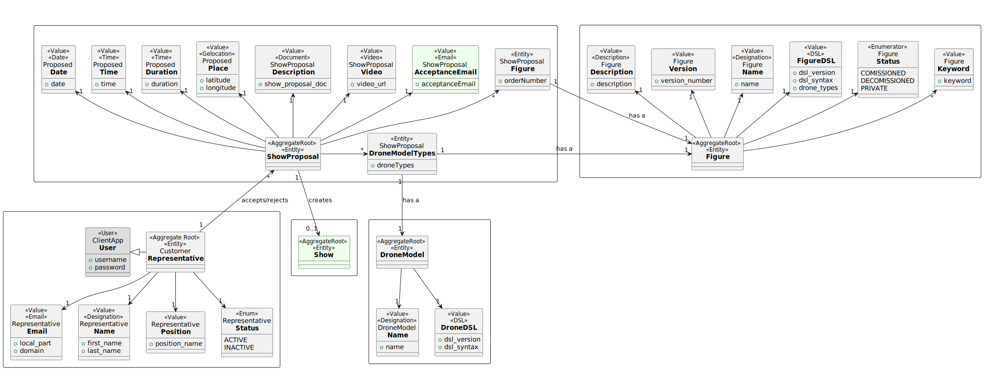

# US312 Mark show proposal as accepted

As CRM Collaborator, I want to mark the proposal as accepted by the customer by attaching the customer’s acceptance email.

# Customer Specifications 
No customer specifications nor questions asked to the client.

## Acceptance Criteria
- As a CRM Collaborator, when I open the accepted show proposals menu, I see a notification of the email of the customer that accepted the proposal.
- As a CRM Collaborator, when I open the customer email, I can mark it as accepted, scheduling a show to the date of the proposal and changing it's status in the system to *Done*.

## Dependencies
- US310 Create Show Proposal
- US315 Add video of simulation to the proposal
- US316 Send show proposal to the customer
- US370 Analyse a proposal
- US371 Accept/reject proposal

## Input and Output Data
*Input:*
- Customer acceptance email

*Output:*
- A message saying the show was scheduled

## Definition of done
- Code is written and reviewed
- Tests are written and passed
- Documentation updated

# Analysis

## Domain

# Design

## System Sequence Diagram

