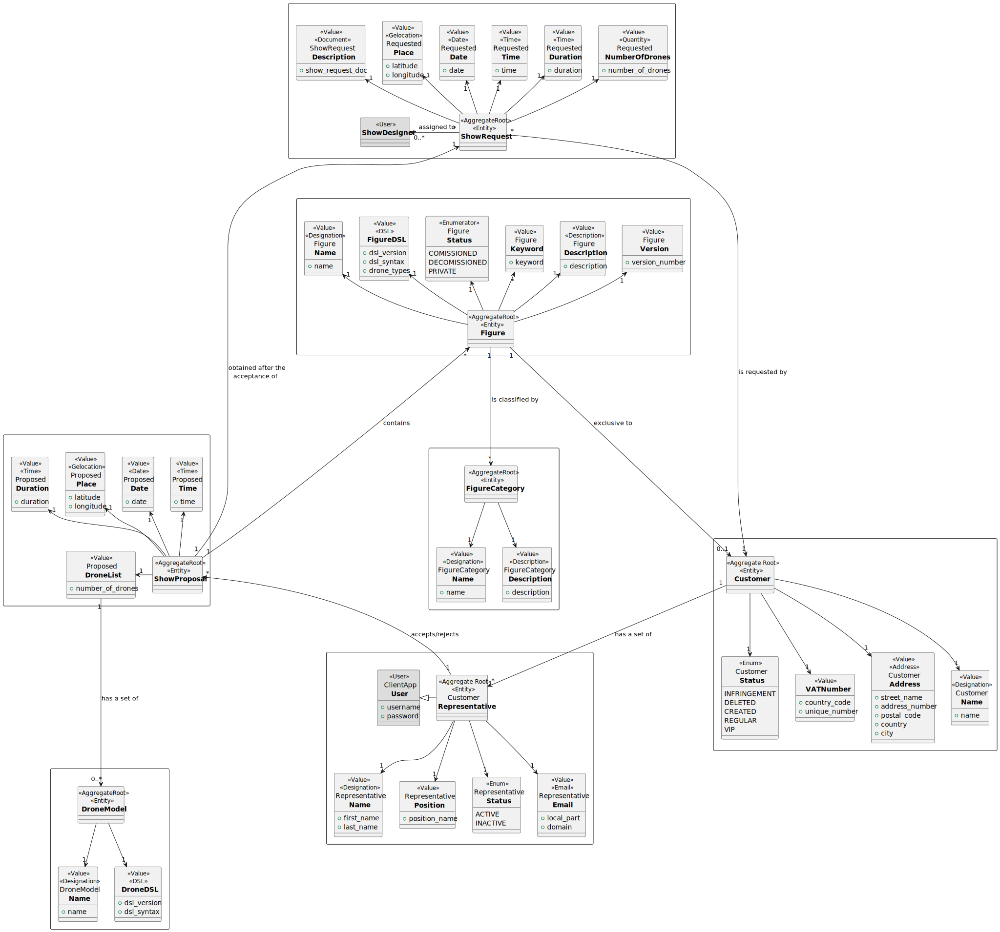

# Analysis

> The construction process of the domain model is based on the Customer specifications, especially the nouns (for
_concepts_) and verbs (for _relations_) used.

## Domain entity list
___

>### *System*
  >- **User**
  >  - Email (Valid email from shodrone's domain (unique))
  >  - User password
  >  - Name
  >  - Phone number
  >  - User role (See System Roles below)
  >  - _User status_
  >    - Active
  >    - Disabled
  >    - Deleted
>>#### *System Roles:*
>>  - **Administrator**
>>  - **CRM Manager**
>>  - **CRM Collaborator**
>>  - **Show Designer**
>>  - **Drone Technician**

>### *Customer*
>- **Customer**
  >  - Name 
  >  - Address
  >  - **List of representatives/employees**
  >    - **Representative/Employee**
  >  - _Status_
  >    - Deleted;
  >    - Infringement;
  >    - Created;
  >    - Regular;
  >    - VIP;
  >  - Vat number
  >    - Country Code
  >    - Identifier
  >  - Customer Status

>### *Representatives*
>- **Customer Representative**
>- Email
>- Name
>- Representative Position
>  - Position name

>### *Figures*
> - **Figure**
>   - DSL Description
>   - DSL Version
>   - Exclusivity
>   - Description
>   - _Figure Status_
>     - Active
>     - Decomissioned
>   - Version Number
>   - Figure Code

>### *Show*
> - **Show**
> - **Show Schedule**
>   - Date
>   - Time of day

>### *Show Request*
>- **Show Request**
>  - **Customer**
>  - Address
>  - Time of day
>  - Number of drones requested
>  - Duration
>  - Description
>  - _Status_
>    - Created
>    - Missing Figures
>    - Valid
>    - Proposal
>    - Production

>### *Show Proposal*
>- **Show Proposal**
>  - **Customer**
>  - **Figures**
>  - **Show Request**
>  - _Status_
>    - Created
>    - Testing
>    - Valid
>    - Waiting Approval
>    - Rejected
>    - In Production

>### *Drones*
>- **Drone**
>  - Serial number
>  - Drone Model
>    - Model Name
>  - Drone Type
>    - Type Name
>  - _Status_
>    - Active
>    - Decomissed
>    - Removed
>- **Drone Maintenance**
>  - Reason
>- **Removed Drone History**
>  - Reason
>- **Drone Routine**
>  - Drone Code

## Rationale to identify associations between domain entities
___

| Concept (A)           |            Association            |             Concept (B) |
|-----------------------|:---------------------------------:|------------------------:|
| Administrator         |              manages              |                    User |
| CRM Manager           |           can register            |                Customer |
| CRM Manager           |      assigns show request to      |           Show Designer |
| CRM Collaborator      |              creates              |            Show Request |
| CRM Collaborator      |              submits              |            Show Request |
| CRM Collaborator      |             generates             |           Show Proposal |
| CRM Collaborator      |         updates status of         |            Show Request |
| CRM Collaborator      |         updates status of         |           Show Proposal |
| CRM Collaborator      |              manages              |                Customer |
| CRM Collaborator      |              manages              | Customer Representative |
| CRM Collaborator      |              manages              |                  Figure |
| CRM Team              |             schedules             |                    Show |
| Drone Technician      |              manages              |                   Drone |
| Drone Technician      |              creates              |             Drone Model |
| Drone Technician      |       generates the code of       |                    Show |
| Drone Technician      |       generates the code of       |                  Figure |
| Show Designer         |               adds                |                  Figure |
| Customer              |          selects sets of          |                  Figure |
| Customer              |        submits proposal of        |                  Figure |
| Customer              |      submits show request to      |        CRM Collaborator |
| Customer              |             asks for              |            Show Request |
| Customer              |              stores               | List of Representatives |
| Customer              |         accepts/declines          |           Show Proposal |
| Show                  |               uses                |                   Drone |
| Show                  |         is a sequence of          |                  Figure |
| Show                  |          generated from           |           Show Proposal |
| Show Proposal         |          generated from           |            Show Request |
| Show Proposal         |         contains a set of         |                  Figure |
| Show Request          |           requested by            |                Customer |
| Figure                |        is a composition of        |                   Drone |
| Figure                |           exclusive to            |                Customer |
| Drone Maintenance     |      records maintenance of       |                   Drone |
| Removed Drone History | provides reason to the removal of |                   Drone |
| Drone Routine         |             is run by             |                   Drone |

## Domain Model

