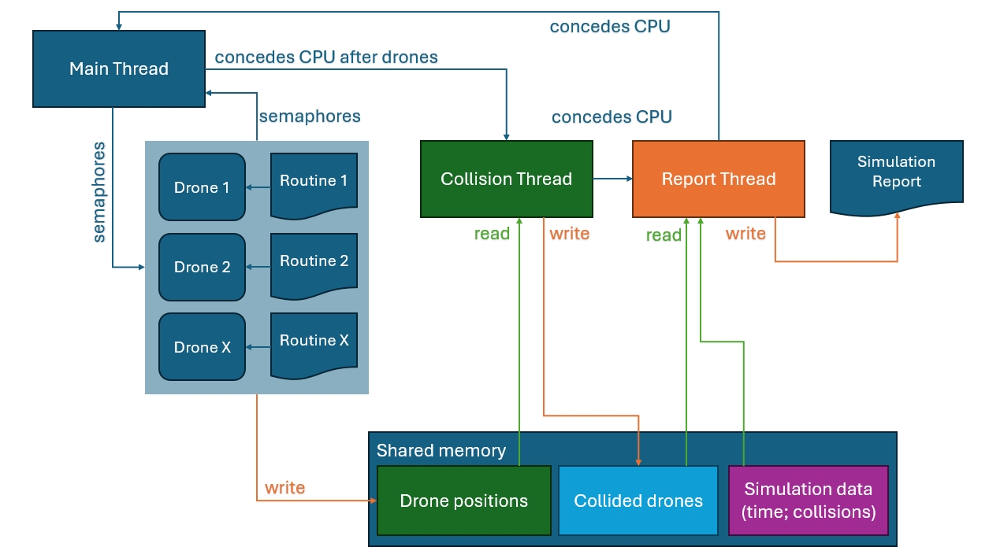

# Relatório do simulador

## Diagrama de componentes



## Exemplo de input

O simulador recebe como input ficheiros `.txt` com um nome genérico `drone_X.txt`, onde `X` representa o identificador do drone. Cada linha contém a posição `(x;y;z)` para onde o drone se deve mover em cada passo de simulação.

```
x;y;z
0;0;0
1;1;1
2;2;2
...
```

## Abordagem das User Stories (Sprint Atual)

### US361 – Inicialização com memória partilhada e múltiplos processos

A simulação começa com a criação de um processo principal (parent) que cria:
- Threads especializadas (e.g., deteção de colisões, geração de relatório).
- Processos independentes para cada drone (`fork()`).

Uma região de memória partilhada (`shm_open`) é alocada para armazenar:
- Posições atuais de todos os drones.
- Flags de colisão.
- Estado global da simulação.

Cada processo drone escreve diretamente na memória partilhada. A sincronização entre processos é feita com *semaforos nomeados* (per-drone e globais).

### US362 – Threads especializadas no processo principal

O processo principal cria pelo menos duas threads:
- **Thread de Deteção de Colisões:** Compara as posições dos drones e regista colisões.
- **Thread de Relatórios:** Gera relatórios baseados nos eventos detetados.

As threads partilham o estado via memória partilhada e comunicam entre si usando `pthread_cond_t` e `pthread_mutex_t`.

### US363 – Notificação via variáveis de condição

Quando a thread de colisão deteta um conflito, sinaliza a thread de relatório com uma variável de condição (`pthread_cond_signal`). O relatório é então gerado com:
- Timestamp.
- Drones envolvidos.
- Coordenadas da colisão.

### US364 – Sincronização passo-a-passo da simulação

O avanço da simulação é feito por passos discretos, controlados por *semaforos*:
- Cada drone espera por `sem_step_start_X` para avançar.
- Após completar o passo, sinaliza com `sem_step_end_X`.

Só quando **todos os drones terminam o passo atual**, o processo principal:
1. Ativa a thread de colisão via `sem_collision_start`.
2. Espera que a verificação termine (`sem_collision_end`).
3. Avança para o próximo passo se a simulação continuar.

Este sistema garante que drones e threads operam em total sincronia.

### US365 – Geração e gravação do relatório final

A thread de relatório mantém o ficheiro `simulation_output.txt` atualizado em tempo real. Quando a simulação termina (por colisões ou conclusão de todas as rotas), é escrito um resumo final com:
- Total de drones.
- Total de colisões.
- Passos de simulação realizados.
- Resultado da simulação: `SUCCESS` ou `FAILED`.

Todas as mensagens são também impressas na consola com PID e TID associados.

---

## Autoavaliação (0–100)

| Membro   | US361 | US362 | US363 | US364 | US365 |
|----------|-------|-------|-------|-------|-------|
| 1221402  | 0     | 100   | 0     | 0     | 0     |
| 1230896  | 0     | 0     | 100   | 0     | 0     |
| 1231090  | 100   | 25    | 50    | 25    | 100   |
| 1231092  | 0     | 25    | 50    | 100   | 25   |

---
